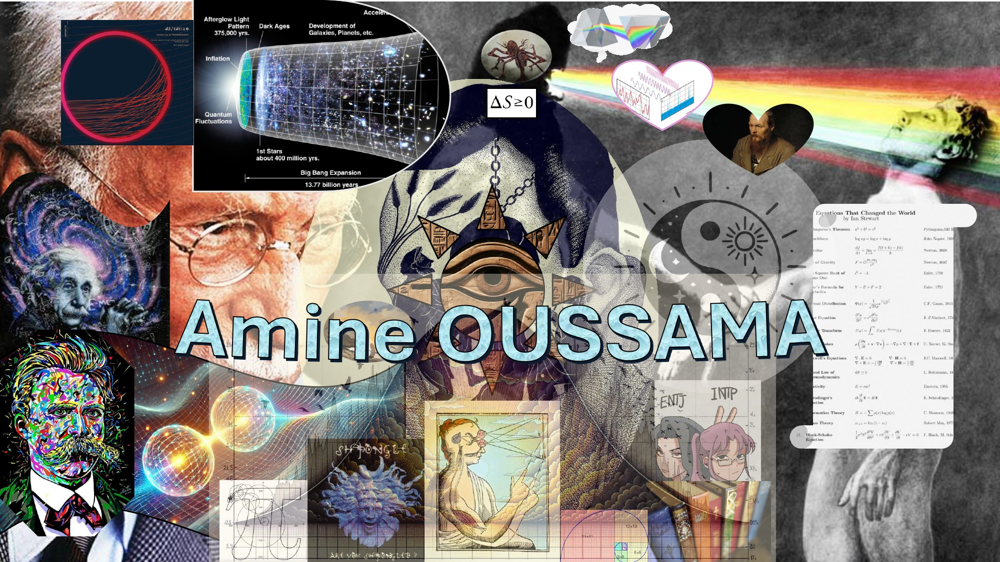

I am currently a PhD candidate in Computer Science, specializing in Operations Research at the University of Clermont Auvergne within the LIMOS laboratory (Laboratoire d'Informatique, de Modélisation et d'Optimisation des Systèmes) in France. My research focuses on developing solutions for job scheduling problems that include transport achieved by mobile robots, particularily cooperative robots. I also hold a Computer Science Engineering degree with a specialization in Information Systems and Decision Support Tools.